# okDriver Voice Assistant Prototype

A wake-word-activated, streaming voice assistant for okDriver — a road-safety
platform aimed at automotive edge devices (dashcams). You say "Hey Jarvis", ask
something in Hinglish, the assistant transcribes, thinks, and speaks back. The
whole pipeline streams: TTS playback starts before the LLM has finished
generating.

The architectural goal isn't "make one combo work." It's to be modular enough
that any of the seven engines can be swapped via a config edit, and to surface
honest numbers about which combo is actually viable on a dashcam.

For numbers and a real conversation transcript, see [results.md](results.md).

## Architecture

```mermaid
flowchart LR
    Mic([Microphone]) --> WW["Wake Word<br/>openWakeWord<br/>'hey jarvis'"]
    WW -->|detected<br/>t_wake| VAD[Silero VAD<br/>silence > 600ms<br/>or 15s cap]
    VAD -->|t_end_of_speech| STT[STT<br/>faster-whisper<br/>base or small]
    STT -->|t_stt_done<br/>transcript| LLM[LLM streaming<br/>Groq · Local Ollama · Cloud Ollama]
    LLM -->|tokens<br/>t_llm_first_token| Chunker["Sentence chunker<br/>regex /[.!?।]+/"]
    Chunker -->|sentences<br/>t_first_sentence_to_tts| TTSQ[(TTS input queue)]
    TTSQ --> TTSW[TTS worker thread<br/>Piper or edge-tts]
    TTSW -->|audio<br/>t_first_audio_ready| AOQ[(Audio output queue)]
    AOQ --> PB[Playback worker]
    PB -->|t_first_audio_played<br/>= E2E latency anchor| Speaker([Speaker])
    PB -->|t_playback_done| Done([Turn complete])
```



Mermaid source: [docs/architecture.mmd](docs/architecture.mmd).

## What's actually inside (exact models)

| Slot | Engine | Model | Size | Notes |
|---|---|---|---|---|
| Wake word | openWakeWord | `hey_jarvis_v0.1` (preset) | ~1.3 MB ONNX | ONNX backend (the bundled tflite_runtime breaks under NumPy 2.x) |
| VAD | Silero VAD | `silero_vad.onnx` | ~1.8 MB | 512-sample frames @ 16 kHz |
| STT | faster-whisper | `base` (multilingual) | ~140 MB | CTranslate2 backend, beam_size=1 |
| STT | faster-whisper | `small` (multilingual) | ~470 MB | Same backend, more accurate |
| LLM | Groq | `llama-3.1-8b-instant` | cloud API | Streaming chat completion |
| LLM | Ollama (local) | `gemma4:e4b` | 8B at Q4_K_M (~9.6 GB on disk) | `think=False` to skip reasoning phase |
| LLM | Ollama (cloud) | `gemma4:31b-cloud` | 256K context, dense | Same Python client, different host |
| TTS | Piper | `hi_IN-pratham-medium` | ~60 MB ONNX | Hindi-trained, 22050 Hz output |
| TTS | edge-tts | `hi-IN-SwaraNeural` | cloud API (free) | Best Hinglish prosody, needs network |

Plus the supporting bits: `sounddevice` for mic + speakers, `psutil` for memory
sampling, `rich` for the CLI UI, `jiwer` for WER, `pandas` for CSV/markdown
output.

## Modularity

The orchestrator never knows which engine it's calling. Three abstract bases
in `src/{stt,llm,tts}/base.py` define the contract:

```python
class BaseSTT(ABC):
    def transcribe(self, audio: np.ndarray, sample_rate: int) -> STTResult: ...
    def name(self) -> str: ...

class BaseLLM(ABC):
    def stream(self, system_prompt, user_prompt) -> Iterator[LLMChunk]: ...
    def name(self) -> str: ...

class BaseTTS(ABC):
    def synthesize(self, text: str) -> TTSResult: ...
    def name(self) -> str: ...
```

[`src/pipeline.py`](src/pipeline.py) — the `run_turn` function — only ever sees
these interfaces. Concrete classes are looked up by name in
[`src/engines.py`](src/engines.py) and constructed lazily so launching the CLI
doesn't pay the cost of every backend's import.

Adding a new engine — say, Whisper-large-v3 or a Bhashini API endpoint — is two
files: a new class subclassing the base, and a one-line entry in
`engines.py`. Nothing in `cli.py`, `benchmark.py`, or `pipeline.py` changes.

The two Ollama-backed engines (`gemma4_local`, `gemma4_cloud`) share
[`src/llm/_ollama_base.py`](src/llm/_ollama_base.py) — they differ only in the
`host` argument and an API key. That alone is the headline of the deployment
discussion below.

## Streaming pipeline mechanics

The headline metric is `e2e_latency_sec` = `t_first_audio_played` −
`t_end_of_speech`. Three things compress it:

1. **VAD ends the recording the moment you stop.** No fixed-window padding.
   The clock starts as early as possible.
2. **Sentence chunker fires on `.!?।`** as the LLM is still streaming. The
   first sentence reaches the TTS queue while the model is still generating
   the rest. The Devanagari danda `।` is critical — pure-Hindi outputs would
   never flush otherwise.
3. **TTS and playback run in their own threads.** Synthesis of sentence N+1
   overlaps with playback of sentence N. Throughput, not just latency.

Plus the system prompt forces 1–3 sentence Hinglish responses with mandatory
end-of-sentence punctuation. Without that constraint, sentence chunking either
never fires or fires on commas (wrong).

## Deployment paradigm trade-offs

STT and TTS stay local — voice I/O is bandwidth-heavy and a dashcam can't
depend on cellular to talk to its driver. That's not negotiable.

The interesting axis is the LLM. This prototype's LLM lineup is *not* three
flavours of the same paradigm; it's three *different* paradigms okDriver might
realistically pick:

| Slot | Paradigm | Pros | Cons |
|---|---|---|---|
| `groq_8b` | Cloud API (proprietary) | Lowest TTFT (~0.15s), no on-device GPU, ~110 tps | Vendor lock-in, paid past free tier, hard network dependency |
| `gemma4_local` | Local GPU on the device | Offline, zero per-request cost, TTFT matches Groq (~0.2s) on 8B-Q4 | Bounded model size, tied to on-device hardware, ~20 tps (5× slower than Groq throughput) |
| `gemma4_cloud` | Cloud-hosted open weights | Frontier-scale capability, no vendor lock-in, same Ollama API as local | Highest TTFT (~0.7s), still needs network, free tier is rate-limited |

The benchmark surfaces the practical cost of each: TTFT, end-to-end latency,
peak memory, throughput. The point isn't to declare a winner — it's to
quantify what okDriver actually pays for each architectural choice.

## Per-engine pros and cons (the rest of the matrix)

| Engine | Good at | Caveats |
|---|---|---|
| `fw_base` STT | Speed (RTF ~0.03), low memory (~325 MB), totally fine on clean English | Mangles short Hinglish; auto-detects Urdu/Devanagari and produces text in the wrong script |
| `fw_small` STT | More accurate Hinglish transliteration on longer clips, still real-time (RTF ~0.09) | 3× the memory of `fw_base`, still struggles on 3-word utterances |
| `groq_8b` LLM | Fastest TTFT and TPS, generous free tier | Network-only, vendor dependency, 8B is a small model — fine for short answers, not for nuance |
| `gemma4_local` LLM | Offline, fast TTFT on consumer GPU, full data privacy | Slower TPS (~20), needs `think=False`, RTX 3050 6GB has to spill to RAM at Q4 |
| `gemma4_cloud` LLM | Frontier-scale OSS without lock-in, 256K context | Highest TTFT, free-tier limits, network round-trip per request |
| `piper` TTS | Local, fast (RTF ~0.02), no network | Hindi voice quality is functional, not great for English code-switches |
| `edge_tts` TTS | Best Hinglish prosody, natural-sounding | Per-sentence HTTPS round-trip adds ~300ms; not viable offline |

## Quick start

```bash
# 1. Python env (3.10+)
python -m venv .venv && source .venv/bin/activate
pip install -r requirements.txt

# 2. System libs (Linux)
sudo apt install libportaudio2 ffmpeg

# 3. Secrets (only the slots you want to use)
cp .env.example .env
# edit: GROQ_API_KEY (for groq_8b)  and/or  OLLAMA_API_KEY (for gemma4_cloud)

# 4. Local Ollama (only for gemma4_local)
curl -fsSL https://ollama.com/install.sh | sh
ollama pull gemma4:e4b

# 5. Live demo
python cli.py                                      # interactive engine picker
python cli.py --stt fw_base --llm groq_8b --tts edge_tts   # fastest combo

# 6. Ablation benchmark (after recording test_audio/*.wav)
python benchmark.py --combos all
```

## Repository layout

```
okdriver-voice-bot/
├── cli.py                       # interactive demo (Rich UI, wake word + VAD live)
├── benchmark.py                 # 12-combo ablation harness, non-interactive
├── config.yaml                  # all tunables (engines, thresholds, model tags)
├── results.md                   # findings + live transcript
├── src/
│   ├── pipeline.py              # run_turn — streaming orchestrator (the heart)
│   ├── engines.py               # name → constructor factory
│   ├── prompts.py               # system prompt
│   ├── audio_io.py              # mic capture, playback, NullPlayback
│   ├── wake_word.py             # openWakeWord wrapper (ONNX backend)
│   ├── vad.py                   # Silero VAD wrapper
│   ├── metrics.py               # peak-RSS sampler + perf_counter helpers
│   ├── stt/                     # BaseSTT + faster-whisper base/small
│   ├── llm/                     # BaseLLM + groq + ollama (local & cloud share base)
│   └── tts/                     # BaseTTS + piper + edge-tts
├── test_audio/manifest.json     # filename → reference transcript
├── docs/architecture.mmd        # Mermaid source
└── results/                     # ablation.csv, ablation_summary.md, cli_log.jsonl
```

## Configuration

Everything tunable lives in [config.yaml](config.yaml):

- Wake word model + threshold (lower the threshold if it ignores you)
- VAD silence cutoff (default 600ms — bump to 900ms if you pause mid-thought)
- Audio sample rate (16 kHz everywhere — STT and Silero both expect this)
- Default engines per slot (used when CLI flags are omitted)
- Per-engine model IDs (Groq model, Ollama tags, Piper voice, edge voice)

Loading is one-shot at process start. There's no runtime hot-swap because
loading Whisper takes 5–30s and the spec calls relaunching cleaner.

## What this prototype is not

- Not a custom-trained wake word. Off-the-shelf `hey_jarvis` only.
- Not multi-turn. Each turn is independent. No conversation memory.
- Not streaming STT. The user finishes speaking, then STT runs once on the
  buffered clip. (LLM and TTS *are* streaming.)
- Not actual edge-device deployment. Desktop prototype proving viability.
- Not a GUI. CLI only — Rich panels are as fancy as it gets.
- Not language-agnostic. The system prompt and TTS voices are tuned for
  Hinglish. English-only inputs work fine; pure-other-language inputs aren't
  in scope.

## Honest known issues

- **Whisper-base on short Hinglish utterances** auto-detects Urdu/Devanagari.
  WER appears terrible because reference is romanized; the LLM still recovers
  most of the time. Fix is more clips and/or a bigger Whisper.
- **`gemma4:e4b` is a "thinking" model.** Without `think=False` it never emits
  user-facing content. Handled in [_ollama_base.py](src/llm/_ollama_base.py)
  but worth knowing if you swap in another Gemma variant.
- **edge-tts has a network tax.** ~300ms per sentence. That's ~half the E2E
  budget on Piper combos.
- **`tflite_runtime` is incompatible with NumPy 2.x.** We force openWakeWord to
  use the ONNX backend instead. If you upgrade openWakeWord and it stops
  honoring `inference_framework="onnx"`, this will break — pin numpy<2 in that
  case.

See [results.md](results.md) for the full ablation table and a real
conversation transcript.
